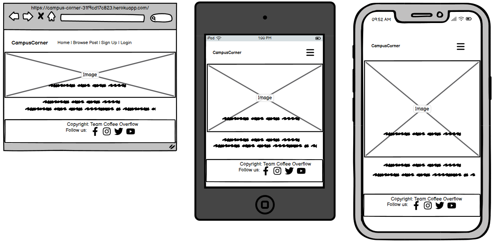
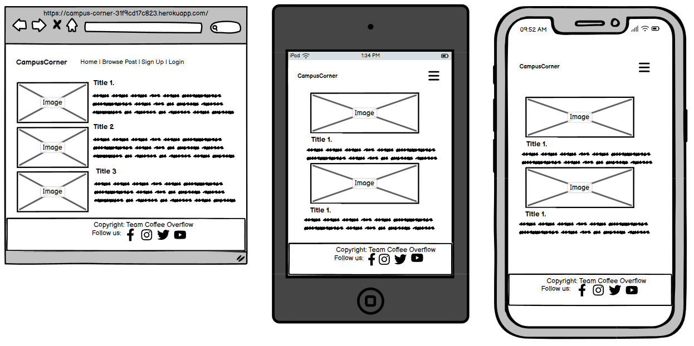
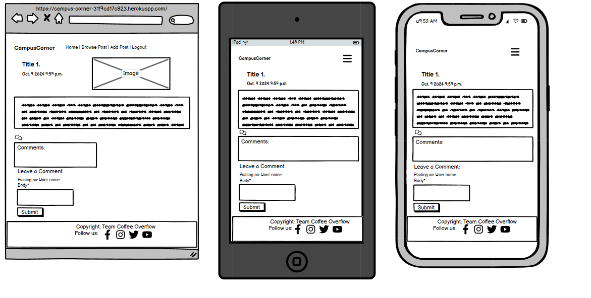
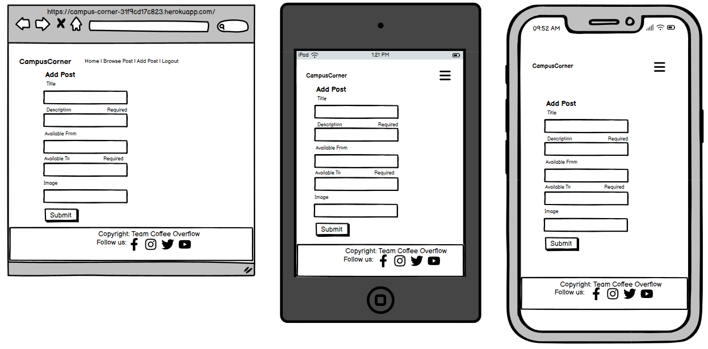
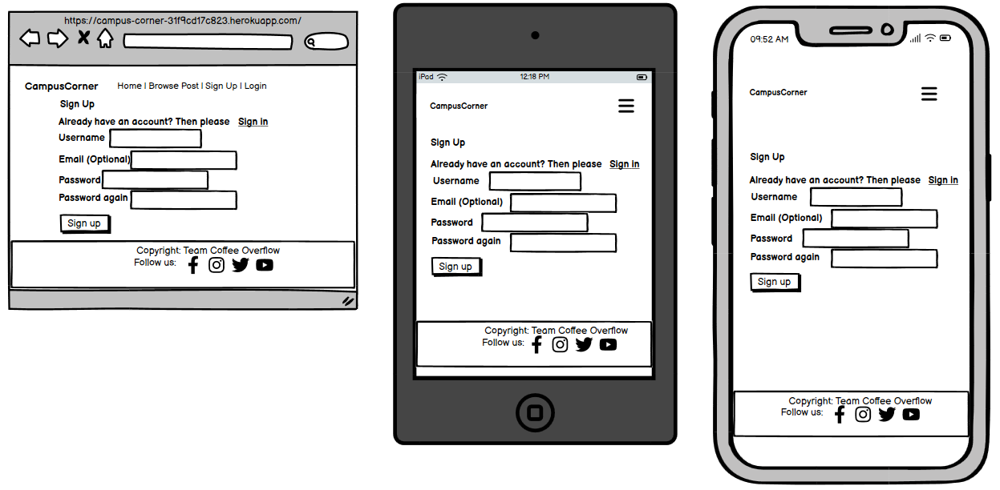
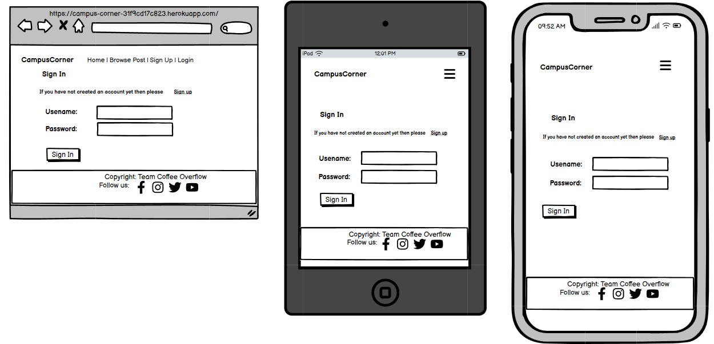
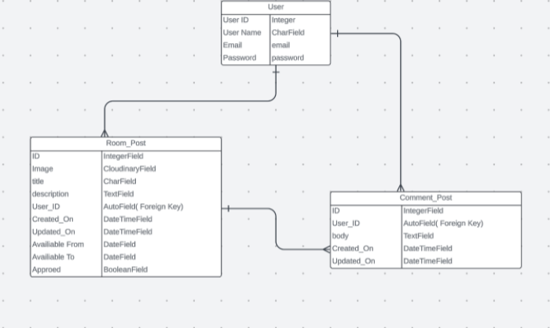

<h1 align="center"> Campus Corner <h1>

## Purpose and Targeted Audience
- The purpose of the website is to show the information to the users/visitors about which rooms are available for rent, the details of the rooms with images and other information provided so that they get to know about the posted rented rooms details.
- Targeted audience are mostly students who are seeking room for rent in their feasible area. 
- Room owners who wants to put advertisement about renting their rooms can add the post on website via fill up the form on website, so other interested people can see their post and comment on it.

### The live link is available here [Campus-Corner](https://campus-corner-31f9cd17c823.herokuapp.com/)

-----------------------------------------------------------------------------------------------------------------

## [Content](#content)
  - [Purpose and Targeted Audience](#purpose-and-targeted-audience)
  - [User Experience](#user-experience---ux)
  - [Project Board](#please-find-the-project-board-with-the-user-stories-here)
  - [User Stories](#user-stories)
  - [Design](#design)
  - [Wireframe](#wireframes)
  - [Entity Relationship Diagram--ERD](#database-diagram)
  - [Website Features](#features)
  - [Admin Panel](#admin-panelsuperuser)
  - [Technology Used](#technologies-used)
  - [Deployment](#deployment)
  - [Credits](#credits)

# User Experience - UX

## Site Aims

* Campus Corner is a website mainly meant to explore and check the availability of rented rooms for collage students.
* This website provides the user with the ability to read and view posts of available rooms for rent.
* All users who sign up and sign in, can access the features of all posts, can comments on it for inquiry and also add their own rented rooms posts on this website.

## Agile Methodology

The Agile Methodology was used to plan this project. This was implemented through Github and the Project Board. Through the use of the Kanban board in the projects view in Github, the project was divided into a few different sections: 

* To Do- (All the User stories were initially entered in the 'To Do' column)
* In Progress- (then during development story they were moved into the 'In Progress' column)
* Done- (and then finally they get moved into 'Done' once the development completes)

### Please find the Project Board with the user stories [here](https://github.com/users/JyotiHambir-BC/projects/10)

-----------------------------------------------------------------------------------------------------------------

## User Stories

#### For Admin
* As a site admin/author, I can create, read, update and delete (CRUD) posts to manage the blog content.
* As a site admin, I can delete any comment or have authority to approve the comments posted by registered user so that I can filter out objectionable comments.
* As a site admin/author, I can approved the posts which are posted by registered users so that it will published on website or delete the unwanted posts.

#### For Visitor of website
* As a site visitor I can easily see the purpose of the site from the landing page so that I can see if the site is relevant to my needs.
* As a site visitor I can view a list of rented rooms so that I can get to know available rooms for rent.
* As a site visitor I can click on a post so that I can read the full article.
* As a site visitor, I can view comments on an individual post so that I can read the conversation.
* As a site Visitor, I can register an account so that I can comment on a post and can fill up the form for the rooms which I want to add on rent to this website .

#### For Registered / Signed-In Users
* As a registered user, I can login and logout of the site so that I can access my content.
* As a logged-in user I can leave comments on a post so that I can be involved in the conversation.
* As a logged-in user I can edit/delete my comments so that I can update/delete my post opinion.
* As a logged-in user I can get the facility to post new rooms which are available for rent so that other users can know about it and can contact me in comment box.

-----------------------------------------------------------------------------------------------------------------

## Design

### Typography

- **Roboto** and **Lato** fonts were imported using Google Fonts with backup of san-serif .

-----------------------------------------------------------------------------------------------------------------

### Imagery
*

-----------------------------------------------------------------------------------------------------------------

### Wireframes

**Homepage**

**Browse Post Page**

**Post Detail Page**

**Add Post Page**

**Sign-Up Page**

**Login Page**

-----------------------------------------------------------------------------------------------------------------

### Database Diagram

Smart Draw was used to create a database schema to visualise the types of custom models the project requires. This schema was used as a guide to what needed to be added to each model. Below is the Database structure that this project is based on. The relationship between Entities Post and Comment are shown in this diagram.

-----------------------------------------------------------------------------------------------------------------

# Features

## Home Page

## Navbar

- The navigation bar is present at the top of every page and navigates all links to the respective pages.
- The options to Register or Log in will change to the option to log out once a user has logged in.
- The navbar is fully responsive, collapsing into a hamburger menu when the screen size becomes smaller.

## Browse Post Page

## Post Detail Page

## Add Post page

**Sign-Up Page**

**Login Page**

## Footer

- On the website footer, users can see basic information such as my social media, copyright about Campus-Corner Website.

-----------------------------------------------------------------------------------------------------------------

### Post Detail page Comment Section

- If user is signed-in and navigate to post detail page, following comment box will appear. And user can see there own unapproved comments (if any) or all approved comments posted by different users.

* Submitted comment which is waiting for admin approval

* Comments which admin have approved already.

* When User submit a comment or like/unlike a post, following messages/ alert displays respectively.

-----------------------------------------------------------------------------------------------------------------

- Signed-in users can only edit/delete their own comments.

- When the user clicks on the delete button to remove his comment, following alert message pops up.

- When the user clicks on the delete button again, following alert message pops up.

- When user clicks on  Edit button, the existing comment's text appeared in body textbox to change, if user wants to change / update anything in existing comment. And the Submit button will change into Update button as shown below.

- When user clicks on update button, a successful update alert message is displayed and the updated comment will show in comments list.

-----------------------------------------------------------------------------------------------------------------

## Security
In order to properly interact with the website, the user needs to have an account and sign in. This ensures security of their comments and gives them rights to create, modify and delete them.

### Sign Up

- User is asked to enter username and password to sign up. User will be guided by validation messages if the username exists or password is too small which was created by modifying Django inbuilt templates. 

- When users sign up to the website they will see a message at the top of the page saying "Successfully signed in as (username)".

### Sign In

- The Sign In page will display when User will click on login page

- User can enter username and password to sign in. User will be guided by validation messages if the username or password is not correct. This was created by modifying Django inbuilt templates.

- When users sign in to the website they will see a message at the top of the page saying "Successfully signed in as (username)".

### Sign Out

- If the user is signed-in, then only they can see Logout nav-item in navbar. User will be taken to the Sign Out page. This was created by modifying Django inbuilt templates. When the user signs out, they are redirected to homepage.

- When users log out of the website they will see a message at the top of the page saying "You have signed out".

-----------------------------------------------------------------------------------------------------------------

## Admin Panel/Superuser

- Admin accesses the project via logging into Django admin panel with a superuser id and password. The page appears as shown [here](assets/admin-panel/admin-homepage.png)
- A superuser "admin" was created for this project to manage the admin panel.
- On the Admin Panel, the admin have full access to CRUD functionality so admin can view, create, edit and delete the following ones:
  - Room Posts
  - Comments
- Admin can also approve comments, post which are posted by registered users and change the status and give other permissions to the users.

### Admin 'Room Posts' Model Management

- On selecting Blog "Room Posts", a list of blog posts is displayed with its title and created_on. Admin can select the post and edit or delete its data.

`The admin site for room posts model appears as shown` [here](assets/admin-panel/admin-roompost-page.png).

### Admin 'Comment' Model Management

- Upon selecting the Blog "Comment" model, a list of comments on a post is displayed with the username, comment body, post title, status and created_on. Admin can select the comment and edit or delete its data.

`The admin site all comments list appears as shown` [here](assets/admin-panel/admin-comment-page.png).

- When a comment is submitted by a user, it requires approval from an admin in order to publish it on the comments section.

`The admin site for comment model approval appears as shown` [here](assets/admin-panel/admin-comment-details.png).

-----------------------------------------------------------------------------------------------------------------

## Technologies Used

### Languages Used

* [HTML 5](https://en.wikipedia.org/wiki/HTML/)- Used to structure all the templates on the site
* [CSS 3](https://en.wikipedia.org/wiki/CSS)- to provide extra styling to the site
* [JavaScript](https://www.javascript.com/)- Minimum javascript was used to fade out alerts after a few seconds.
* [Python](https://www.python.org/)- To provide the functionality to the site. Packages used in the project can be found in requirements.txt

### Django Packages

* [Gunicorn](https://gunicorn.org/)- As the server for Heroku.
* [Cloudinary](https://cloudinary.com/)- Was used to host the static files and media for the site.
* [Dj_database_url](https://pypi.org/project/dj-database-url/)- To parse the database URL from the environment variables in Heroku.
* [Psycopg2](https://pypi.org/project/psycopg2/)- As an adaptor for Python and PostgreSQL databases.
* [Summernote](https://summernote.org/)- As a text editor.
* [Allauth](https://django-allauth.readthedocs.io/en/latest/installation.html)- For authentication, registration, account management.
* [Crispy Forms](https://django-crispy-forms.readthedocs.io/en/latest/)- To style the forms.

### Frameworks - Libraries - Programs Used

* [Django](https://www.djangoproject.com/) was used as the framework for the back-end logic of the project. Django enables rapid and secure development.
* [Bootstrap](https://getbootstrap.com/)- Used to style the website, add responsiveness and interactivity.
* [Git](https://git-scm.com/)- Used for version control by utilizing the Gitpod terminal to commit to Git and push to GitHub.
* [GitHub](https://github.com/)- Used to store the project's code after being pushed from Git.
* [Heroku](https://id.heroku.com)- Used to deploy the live project.
* [PostgreSQL](https://www.postgresql.org/)- Database used through heroku.
* [Balsamiq](https://balsamiq.com/)- To build the wireframes for the project.
* [Google Chrome Developer Tools](https://developers.google.com/web/tools/chrome-devtools) was used to inspect page elements, debug, troubleshoot and test features and adjust property values. Using the Lighthouse extension installed in Chrome Browser, the performance report was generated.
* [Google Fonts:](https://fonts.google.com/) used for the Poppins and Protest Guerrilla font
* [Font Awesome:](https://fontawesome.com/) was used to add icons for aesthetic and UX purposes.

-----------------------------------------------------------------------------------------------------------------

## Testing

### Manual Testing:

Testing has taken place continuously throughout the development of the project. Each view was tested regularly.

[Manual Testing Report]()

-----------------------------------------------------------------------------------------------------------------

### Validation
We used the following validation tools to validate HTML, CSS, PYTHON codes. Below the link of TESTING.md file, which includes all validation results.  
- HTML using [W3C HTML validator](https://validator.w3.org/)
- CSS using [Jigsaw CSS validator](https://jigsaw.w3.org/css-validator/)
- Python via [PEP8 CI Python Linter](https://pep8ci.herokuapp.com/)

### Validation Report

-----------------------------------------------------------------------------------------------------------------

## Bugs

-----------------------------------------------------------------------------------------------------------------

## Future Implementation
* Search Bar on top-right side of website to search the information or specific post.

-----------------------------------------------------------------------------------------------------------------

## Deployment

### 1. Creating the Django Project:
* Go to the Code Institute Gitpod Full Template [ci-full-template](https://github.com/Code-Institute-Org/ci-full-template).
* Click on `Use This Template` button, then create new repository.
* Name our repository and click on `Create repository from template` button.
* Once the template is available in your repository click on `Gitpod` button.
* When the image for the template and the Gitpod are ready, open a new terminal to start a new Django App.
* Install Django and gunicorn: `pip3 install 'django~=4.2.1' gunicorn~=20.1`.
* Create a Procfile `Procfile has no extension and P should be Capital`.`Add 1 line code web: gunicorn (project-name).wsgi`.
* Install supporting database libraries dj_database_url and psycopg2 library: `pip3 install dj_database_url==0.5.0 psycopg2`.
* Install Cloudinary libraries to manage static files: `pip install dj-3-cloudinary-storage`.
* Install whitenoise to serve the static files: `pip3 install 'whitenoise~=5.3.0'`
* Create file for requirements: `pip freeze --local > requirements.txt`.
* Create project:`django-admin startproject project_name .`.
* Create app: `python manage.py startapp app_name`.
* Add app to list of `installed apps` in settings.py file: `'app_name'`.
* Migrate changes: `python manage.py migrate`.
* Test server works locally: `python manage.py runserver`.
* If the app has been installed correctly the window will display- The install worked successfully! Congratulations!

### 2. Create your Heroku app:
* Navigate to [Heroku](https://id.heroku.com).
* Create a Heroku account by entering your email address and a password (or login if you have one already).
* Activate the account through the authentication email sent to your email account.
* Click the **new button** on the top right corner of the screen and select create a new app from the dropdown menu.
* Enter a unique name for the application.
* Select the appropriate region for the application.
* Click create app.
* Click Reveal Config Vars and add a new record with `DATABASE_URL`.
* Click Reveal Config Vars and add a new record with `PORT`.
* Click Reveal Config Vars and add a new record with the `DISABLE_COLLECTSTATIC = 1`(note: this must be either removed or set to 0 for final deployment).
* Next, scroll down to the Buildpack section, click `Add Buildpack` select python and click Save Changes.

### 3. Heroku Deployment: 
* Click Deploy tab in Heroku.
* Select Github as the deployment method.
* Confirm you want to connect to GitHub.
* Search for the repository name and click the connect button to link the heroku app with the Github repository. The box will confirm that heroku is connected to the repository.
* Scroll to the bottom of the deploy page and select the preferred deployment type.
* Click either Enable Automatic Deploys for automatic deployment when you push updates to Github or To manually deploy click the button 'Deploy Branch'. The default 'main' option in the dropdown menu should be selected in both cases. When the app is deployed a message 'Your app was successfully deployed' will be shown. Click 'view' to see the deployed app in the browser.

### 4. Final Deployment:
In the IDE:
* When development is complete change the debug setting to: `DEBUG = False` in `settings.py` 
* In Heroku settings config vars remove/delete the `DISABLE_COLLECTSTATIC` and value.
* Because DEBUG must be switched to True for development and False for production it is recommended that only manual deployment is used in Heroku. 
* To manually deploy click the button 'Deploy Branch'. The default 'main' option in the dropdown menu should be selected in both cases. When the app is deployed a message 'Your app was successfully deployed' will be shown. Click 'view' to see the deployed app in the browser.

-----------------------------------------------------------------------------------------------------------------

# Credits

## Code

*

## Learning Resources
- Other open source to understand and solve different types of error : ChatGPT, Stack Overflow

## Content and Media

All images and post content are taken from the 

## Acknowledgement

-----------------------------------------------------------------------------------------------------------------
   
[Back to top ⇧](#content)

-----------------------------------------------------------------------------------------------------------------
